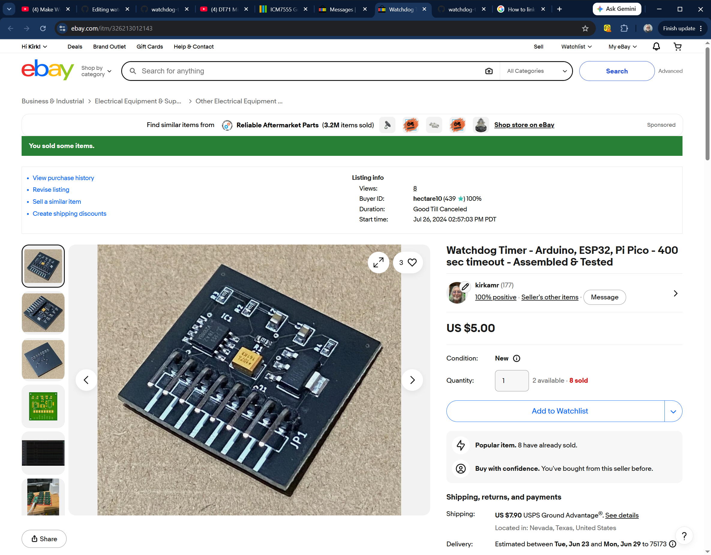
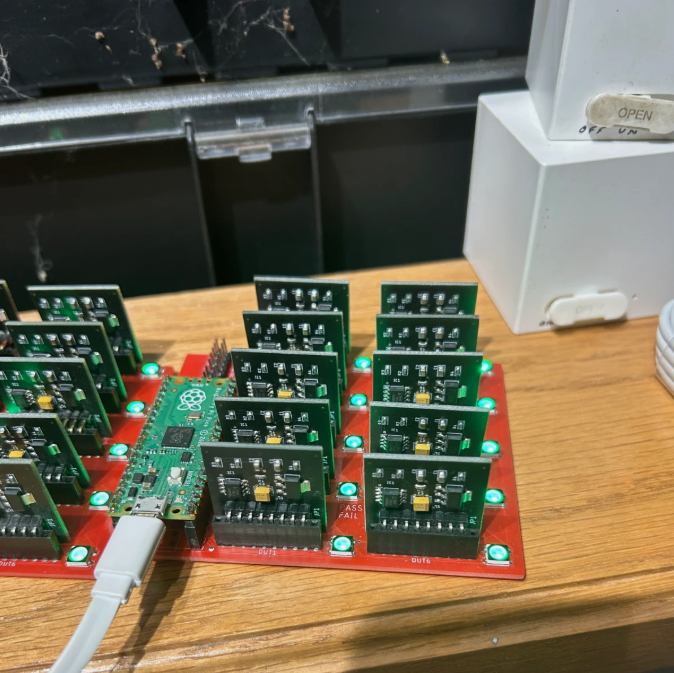

# watchdog-timer
A retriggerable monostable based on the ICM7555, useful in watchdog applications for microcontrollers. 

To use the watchdog;
1. Have your code generate a short negative RESET signal to the watchdog, to initialize the circuit.
 NOTE: there is a capacitor to GND that should initialize the watchdog at power-on.
2. The watchdog has a timeout of about 400 seconds, at which time it will drive the OUTPUT LOW. In addition to the OUPUT signal, a capacitivly-coupled PULSE will temporarily go LOW.
3. To keep the watchdog from timing out, generate a short LOW pulse to the /TRIGGER pin before the 400 seconds is up.

Testing the watchdog units:

1. A Raspberry Pi Pico based test system was developed that runs tests on each watchdog I sell. Besides being a hardware/software developer, I am a professional test engineer with over thirty years of automated system test development experience.
2. The testing checks to insure the timeout period is at least 400 seconds, any board timing out in less than 400 seconds is rejected. It also insures the retriggering works ten times consecutively and then times out properly.

