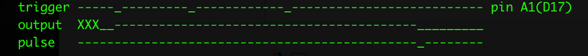
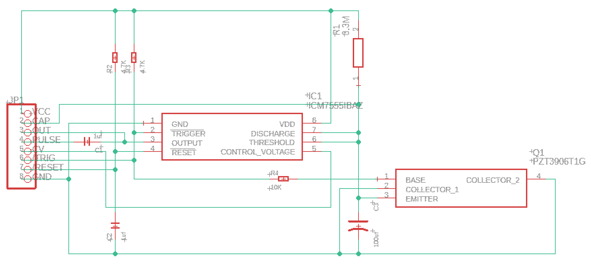
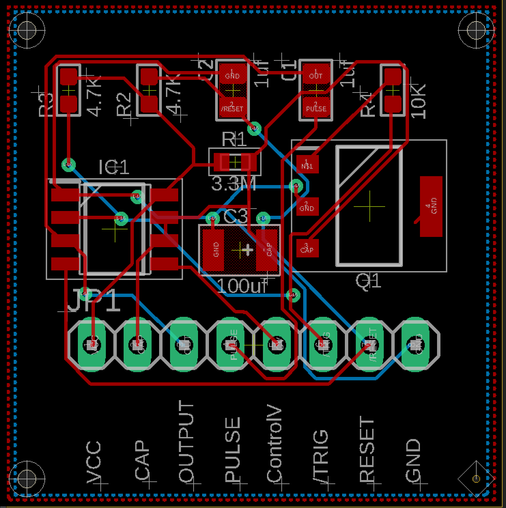
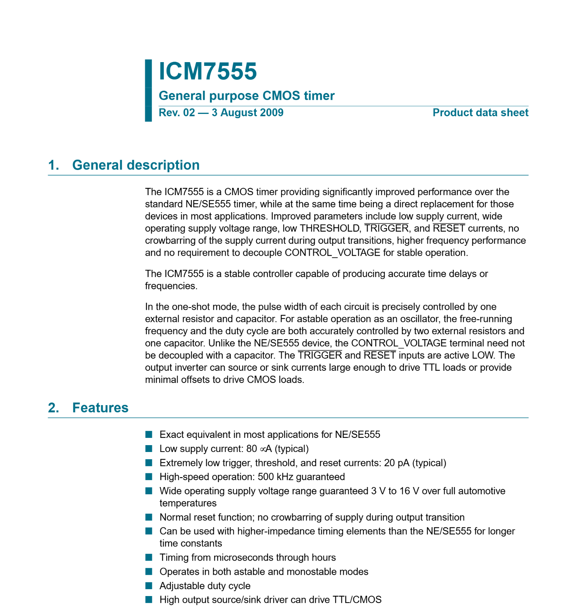

# watchdog-timer
A retriggerable monostable based on the ICM7555, useful in watchdog applications for microcontrollers. 

To use the watchdog;
1. Have your code generate a short negative RESET signal to the watchdog, to initialize the circuit.
 NOTE: there is a capacitor to GND that should initialize the watchdog at power-on.
2. The watchdog has a timeout of about 400 seconds, at which time it will drive the OUTPUT LOW, and a capacitivly-coupled PULSE should temporarily go LOW.
3. To keep the watchdog from timing out, generated a short LOW pulse to the /TRIGGER pin before the 400 seconds is up.

